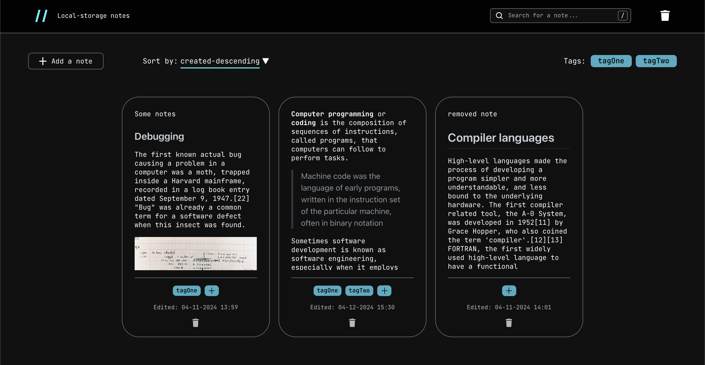
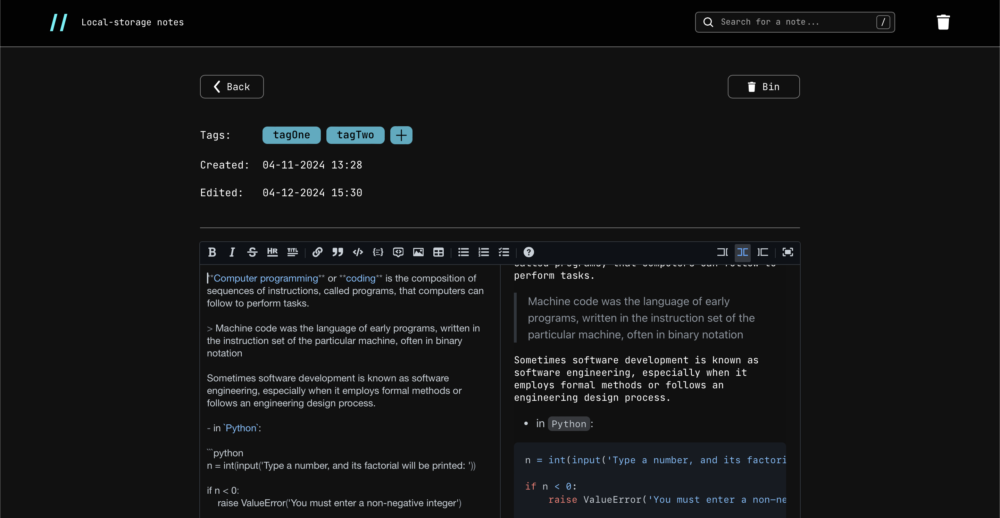

## Slash-Slash - Progressive Web App for Draft Note-taking

<p align="center">
  
</p>

<p align="center">
 
</p>

Slash-Slash is a lightweight web application designed for storing temporary draft notes directly on the client-side, enabling users to work offline and autonomously from a server. Its primary goal is to facilitate quick manipulation of small text drafts with a minimal learning curve.



---



### Key Features

- **Offline Capability**: Seamlessly operates within the browser without requiring a network connection.
- **IndexedDB Storage**: Utilizes IndexedDB for efficient client-side data storage.
- **Markdown Editor**: Integrated editor with Markdown support for text formatting.
- **Tagging System**: Organize notes with tags and filter by them for easy retrieval.
- **Sort and Filter Options**: Sort notes by modified or edited date in ascending or descending order.
- **Open Source**: Fully open-source project with documented code to encourage collaboration and development.

### Technology Stack

- **React**: Front-end framework for building user interfaces.
- **Redux Toolkit**: State management library for handling application state.
- **IndexedDB (via Dexie)**: Client-side database for data storage.
- **React Markdown Editor**: Integrated editor with Markdown support.
- **Moment.js**: Library for date and time manipulation.
- **React Router DOM**: Navigational components for React applications.

### Installation

To run the Slash-Slash application locally:

1. **Clone the Repository**:
   ```bash
   git clone https://github.com/Vladyslbr/slash-slash.git
   ```

2. **Install Dependencies**:
   ```bash
   cd slash-slash
   npm install
   ```

3. **Start the Development Server**:
   ```bash
   npm run dev
   ```

### Usage

Once the development server is running, access the application in your web browser at `http://localhost:3000`.

### Contributing

Contributions to Slash-Slash are welcome! If you'd like to contribute:

1. Fork the repository.
2. Create a new branch (`git checkout -b feature/new-feature`).
3. Commit your changes (`git commit -am 'Add new feature'`).
4. Push to the branch (`git push origin feature/new-feature`).
5. Create a new Pull Request.

### License

This project is licensed under the [MIT License](LICENSE).